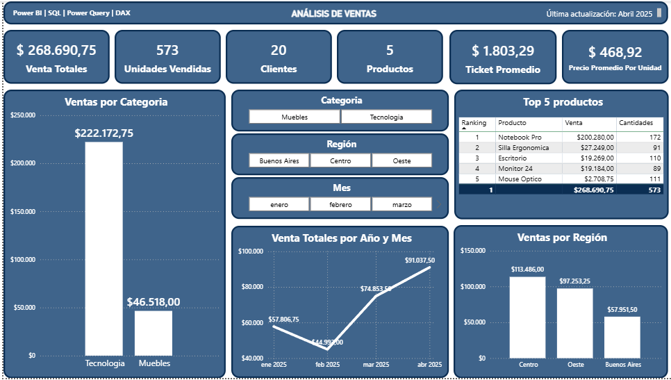
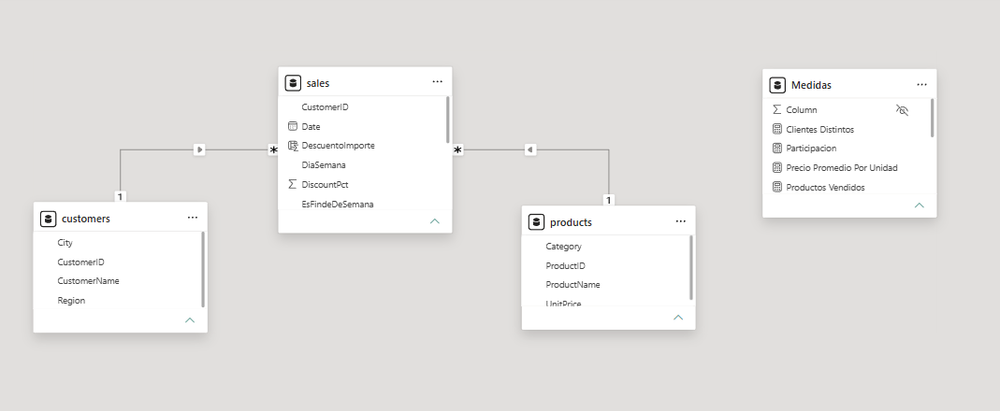
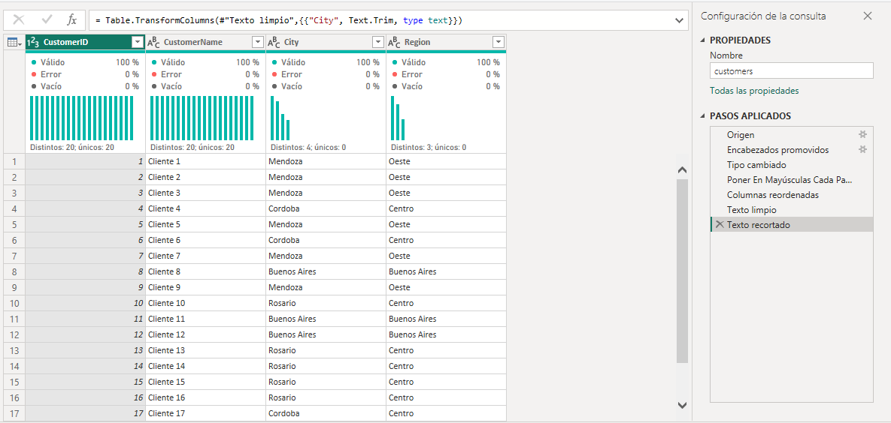
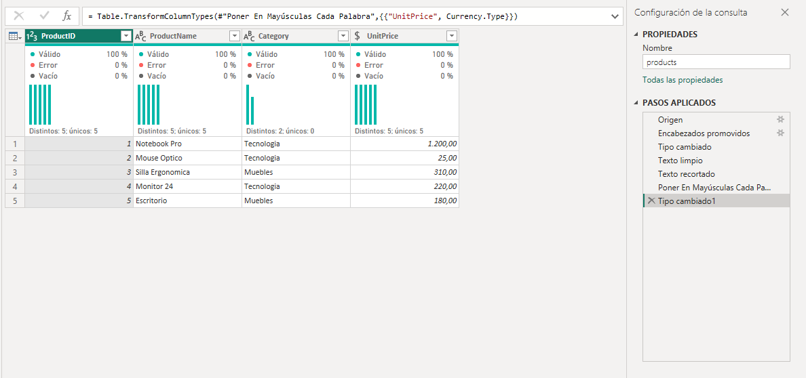
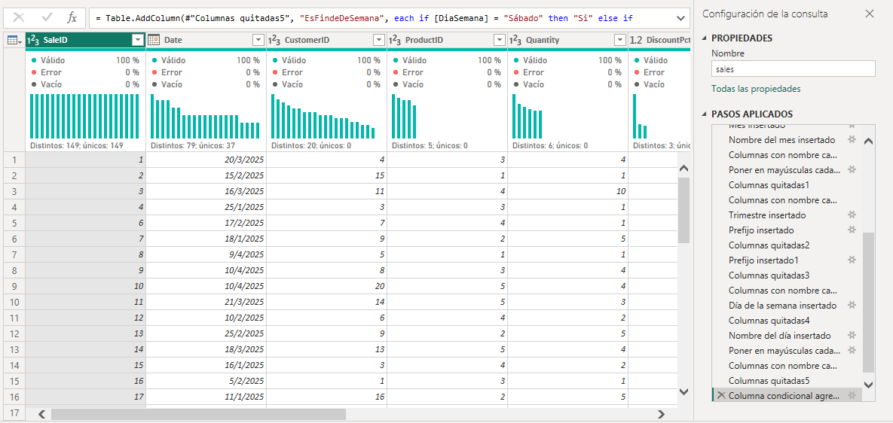

# Sales Analytics Dashboard

Proyecto de análisis de ventas desarrollado con Power BI utilizando Power Query, un modelo de datos en estrella y medidas DAX para transformar datos en información útil para la toma de decisiones.

El proyecto simula un escenario real de análisis comercial, donde se realiza el proceso completo de preparación de datos, modelado, creación de métricas y desarrollo de un dashboard interactivo.

---

## Dashboard

---

## Descripción del proyecto

Este proyecto fue desarrollado como práctica para fortalecer conocimientos en análisis de datos utilizando Power BI.

El trabajo abarca todas las etapas habituales de un proyecto de Business Intelligence:

- Importación de datos desde archivos CSV.
- Limpieza y transformación de datos mediante Power Query.
- Construcción de un modelo de datos en estrella.
- Creación de columnas calculadas y medidas DAX.
- Diseño de un dashboard interactivo.
- Obtención de indicadores e insights de negocio.

El objetivo principal fue desarrollar una solución completa siguiendo buenas prácticas de modelado de datos y visualización de información.

---

## Tecnologías utilizadas

- Power BI Desktop
- Power Query
- DAX (Data Analysis Expressions)
- Modelo de datos en estrella
- Archivos CSV como fuente de datos

---

## Dataset

El proyecto utiliza tres tablas relacionadas:

| Tabla | Descripción |
|--------|-------------|
| Customers | Información de los clientes. |
| Products | Catálogo de productos y categorías. |
| Sales | Registro de todas las ventas realizadas. |

Estas tablas fueron relacionadas mediante un modelo de datos en estrella para optimizar el análisis y el cálculo de métricas.

---

## Modelo de datos

Se implementó un modelo de datos tipo estrella (Star Schema), utilizando la tabla **Sales** como tabla de hechos y las tablas **Customers** y **Products** como dimensiones.

Este enfoque mejora el rendimiento de los cálculos DAX y simplifica el desarrollo de visualizaciones y métricas.

---
## Preparación y limpieza de datos

Antes de construir el modelo de datos se realizó un proceso de limpieza y transformación utilizando Power Query.

Entre las tareas realizadas se incluyen:

- Corrección de tipos de datos.
- Eliminación de registros inconsistentes.
- Reemplazo de valores nulos cuando correspondía.
- Corrección de formato de texto.
- Eliminación de espacios innecesarios.
- Creación de columnas derivadas para análisis temporal.

### Customers

### Products

### Sales

---

## Estado del proyecto

Actualmente el proyecto incluye:

- Limpieza y transformación de datos mediante Power Query.
- Modelo de datos en estrella.
- Creación de medidas DAX.
- Dashboard interactivo con indicadores comerciales.

En los próximos sprints se incorporarán nuevas métricas DAX, análisis temporales, indicadores de desempeño y visualizaciones más avanzadas.

---
